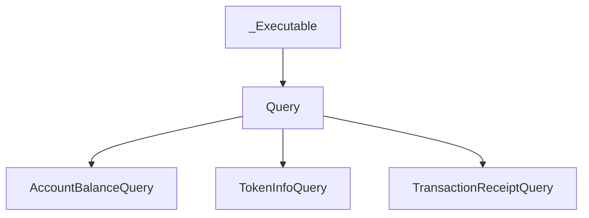

# Understanding the Query Class

## Table of Contents

- [Overview](#overview)
- [Relationship to _Executable](#relationship-to-_executable)
- [Execution Flow](#execution-flow)
- [Query Payment](#query-payment)
- [Abstract Methods](#abstract-methods)
- [Building a Child Query](#building-a-child-query)
- [Retry Logic & Cost Queries](#retry-logic--cost-queries)
- [Reference Implementations](#reference-implementations)
- [Key Takeaways](#key-takeaways)

## Overview

The `Query` class is the base class for all read-only requests made to the Hedera network in the Hiero Python SDK. Queries are used to retrieve network state such as account balances, transaction receipts, and token information.

`Query` inherits from `_Executable`, which provides the shared execution engine for all network operations. On top of this, `Query` adds query-specific functionality such as payment handling, cost calculation, and response processing.

Concrete query classes implement only the logic required to construct the network request and interpret the response, while `Query` and `_Executable` handle execution, retries, and error handling.

## Relationship to _Executable

The `Query` class builds on top of the `_Executable` base class to provide a unified execution model for all Hedera network queries.

`_Executable` is responsible for **network-level concerns**, including:

- Node selection and rotation
- gRPC method invocation
- Automatic retries and backoff
- Error classification and exception mapping
- Logging and execution context management

`Query` does not reimplement these behaviors. Instead, it **specializes** `_Executable` for read-only network operations by adding:

- Query payment handling
- Automatic cost calculation via COST_ANSWER requests
- Query-specific retry defaults
- Response extraction and mapping helpers

This separation allows concrete query classes to remain small and focused. A child query only defines how to construct its request and interpret the response, while all execution mechanics are inherited.



As a result, contributors implementing new queries should not interact directly with networking, retries, or payment transactions. Those responsibilities are handled entirely by _Executable and Query.

## Execution Flow

Query execution follows a structured lifecycle managed jointly by `Query` and its base class `_Executable`. This lifecycle ensures that all queries are executed consistently, with built-in retries, node management, and error handling.

From the perspective of a contributor, executing a query typically involves calling `execute(client)`. Internally, this triggers the following sequence of steps:

### 1. Pre-execution Setup

Before any network request is sent, `_Executable` invokes a pre-execution phase. During this phase, `Query` contributes query-specific setup logic, including:

- Resolving the operator account and signing key from the provided `Client`
- Selecting candidate nodes for execution
- Determining whether the query requires payment
- Calculating or validating the query payment amount

If a query requires payment and no explicit payment has been set, `Query` may perform a preliminary cost query to determine the required amount.

### 2. Request Construction

Once pre-execution checks are complete, the concrete query class is responsible for constructing the network request.

This is done by implementing the `_make_request()` method, which:

- Builds the appropriate Protobuf request body for the query
- Attaches a request header generated by `Query`
- Includes a payment transaction when required

The resulting Protobuf request is wrapped in a `query_pb2.Query` message and passed to the execution engine.

### 3. gRPC Method Invocation

After the request is constructed, `_Executable` handles network execution:

- A node is selected from the available candidates
- The appropriate gRPC method is resolved via the query’s `_get_method(channel)` implementation
- The request is sent to the network over gRPC

Temporary network or platform failures are handled transparently at this stage through automatic retries and backoff.

### 4. Response Extraction and Mapping

When a response is received from the network, the concrete query class extracts the relevant response payload by implementing `_get_query_response(response)`.

`Query` then maps the raw response into a user-facing SDK object. By default, this involves returning the extracted Protobuf response, but subclasses may override `_map_response()` to provide higher-level abstractions.

### 5. Error Handling and Retry Decisions

If the response indicates a failure, `_Executable` and `Query` cooperate to determine the appropriate action:

- Retryable statuses (such as `BUSY` or `PLATFORM_NOT_ACTIVE`) trigger automatic retries
- Non-retryable failures are mapped to SDK exceptions

Concrete query classes may override `_should_retry()` or `_map_status_error()` to customize retry behavior or error mapping when necessary.

### 6. Final Result

Once a successful response is processed, the mapped result is returned to the caller. From the user’s perspective, this entire lifecycle is encapsulated in a single call to `execute(client)`.

This execution model allows queries to remain declarative and concise while relying on a shared, resilient execution engine.

## Query Payment

Unlike transactions, queries do not modify network state. However, some queries require a small payment to cover the cost of processing the request.

The `Query` class manages query payments transparently, allowing concrete query implementations to remain focused on request construction and response handling.

### Zero-cost vs Paid Queries

Not all queries require payment. For example:

- **Low-cost or zero-cost queries (network-determined):**: `AccountBalanceQuery`
- **Paid queries**: `AccountInfoQuery`, `TokenInfoQuery`, `TransactionRecordQuery`

Whether a query requires payment depends on the type of data requested and the network cost associated with retrieving it.

### Setting a Custom Query Payment

Developers may explicitly set the query payment using `set_query_payment`:
Note: This snippet is a simplified illustration. Refer to the Reference Implementations section for end-to-end examples.

```python
from hiero_sdk_python.hbar import Hbar

query = TokenInfoQuery(token_id)
query.set_query_payment(Hbar(1))
```

When a custom payment is set, the specified amount is used directly and no automatic cost lookup is performed.

### Automatic Cost Calculation

If a query requires payment and no payment has been explicitly set, Query automatically determines the required cost by performing a COST_ANSWER query.

This is done by calling `get_cost(client)`, either explicitly by the developer or implicitly during execution:

```python
cost = query.get_cost(client)
print(f"Query cost: {cost} Hbar")
```

Internally, this mechanism sends a preliminary query with the response type set to COST_ANSWER, allowing the network to return the required payment amount without executing the full query.

### Payment Transaction Construction

When executing a paid query, Query constructs a small CryptoTransfer transaction that serves as the query payment.

This payment transaction:

- Is signed using the operator’s private key from the Client

- Is attached to the query request header

- Is handled entirely by the SDK and does not require manual construction

As a result, developers working with queries do not need to interact directly with payment transactions unless they wish to override the default behavior.

## Abstract Methods

Concrete query classes must implement a small set of abstract methods defined by `Query`. These methods allow the SDK to construct and execute the query while keeping execution mechanics centralized in the base classes.

### Required Methods

Every concrete query class must implement the following methods:

| Method | Purpose |
|------|--------|
| `_make_request()` | Constructs and returns the Protobuf `Query` message for the network request |
| `_get_query_response(response)` | Extracts the query-specific response from the full network response |
| `_get_method(channel)` | Returns the gRPC method wrapper used to execute the query |

These methods define the **what** of the query, while `Query` and `_Executable` handle the **how**.

#### `_make_request()`

This method is responsible for building the Protobuf request that will be sent to the Hedera network. Implementations typically:

- Create a request header using helpers provided by `Query`
- Populate the query-specific Protobuf message
- Wrap the request in a `query_pb2.Query` container

Example pattern:
Note: This snippet is a simplified illustration. Refer to the Reference Implementations section for end-to-end examples.

```python
def _make_request(self):
    header = self._make_request_header()
    body = crypto_get_account_balance_pb2.CryptoGetAccountBalanceQuery(
        header=header,
        accountID=self.account_id._to_proto()
    )
    return query_pb2.Query(cryptoGetAccountBalance=body)
```

### `_get_query_response(response)`

This method extracts the relevant response payload from the network response returned by the node.

Implementations typically select the appropriate response field corresponding to the query type.

Example pattern:

```python
def _get_query_response(self, response):
    return response.cryptoGetAccountBalance
```

### `_get_method(channel)`

This method returns the gRPC method used to execute the query against the network.

The returned value is a `_Method` wrapper that binds the query to the appropriate service call on the gRPC channel.

Example pattern:

```python
def _get_method(self, channel):
    return _Method(query_func=channel.crypto.get_account_balance)
```

### Optional Override Methods

In addition to the required methods, Query provides several optional hooks that allow subclasses to customize behavior when necessary.

| Method | Purpose |
|--------|---------|
| `_map_response(response, node_id, proto_request)` | Customize how the response is converted into a user-facing result |
| `_should_retry(response)` | Customize retry behavior for specific response statuses |
| `_map_status_error(response)` | Customize error mapping for non-successful responses |

Most query implementations rely on the default behavior provided by `Query` and `_Executable`. These methods should only be overridden when query-specific handling is required.

### When Should You Override Optional Methods?

Most queries can rely entirely on the default behavior provided by `Query` and `_Executable`. However, certain scenarios may require customization.

The table below summarizes when overriding optional methods is appropriate:

| Scenario | Method to Override | Explanation |
|--------|------------------|-------------|
| Query needs a custom return type | `_map_response()` | Use when you want to return a higher-level SDK object instead of a raw Protobuf response |
| Query has special retry conditions | `_should_retry()` | Override when retry behavior depends on query-specific response fields |
| Query needs custom error interpretation | `_map_status_error()` | Useful if a query maps certain response codes to domain-specific exceptions |

In most cases, **these overrides are unnecessary**. They exist to support advanced or specialized queries while keeping the default implementations simple and consistent.


## Building a Child Query

Concrete queries inherit from the `Query` class. Implementing a new query involves defining:

1. How to construct the network request (`_make_request()`)
2. How to extract the relevant response (`_get_query_response()`)
3. Which gRPC method to call (`_get_method()`)

All execution, retries, payment handling, and error mapping are managed by `Query` and `_Executable`.

### Example: AccountBalanceQuery

Below is a complete implementation of a simple query to retrieve an account balance:

```python
from hiero_sdk_python.query.query import Query
from hiero_sdk_python.hapi.services import (
    query_pb2,
    crypto_get_account_balance_pb2,
)
from hiero_sdk_python.executable import _Method
from hiero_sdk_python.hbar import Hbar


class CryptoGetAccountBalanceQuery(Query):
    """
    Example showing how a Query subclass is structured.
    """

    def __init__(self, account_id):
        super().__init__()
        self.account_id = account_id

    def _make_request(self):
        if not self.account_id:
            raise ValueError("Account ID must be set")

        header = self._make_request_header()

        body = crypto_get_account_balance_pb2.CryptoGetAccountBalanceQuery()
        body.header.CopyFrom(header)
        body.accountID.CopyFrom(self.account_id._to_proto())

        query = query_pb2.Query()
        query.cryptogetAccountBalance.CopyFrom(body)
        return query

    def _get_query_response(self, response):
        return response.cryptogetAccountBalance

    def _get_method(self, channel):
        return _Method(
            transaction_func=None,
            query_func=channel.crypto.cryptoGetBalance,
        )

```

### Usage Example
Once implemented, the query can be executed simply:

```python
from hiero_sdk_python.client import Client

client = Client.for_testnet()
query = AccountBalanceQuery(my_account_id)

# Optional: set custom payment
query.set_custom_payment(Hbar(1))

# Execute query; all retries and payment handled automatically
balance = query.execute(client)
print(f"Account balance: {balance.balance} Hbar")

```

### Notes for Contributors

- **Do not handle retries, node selection, or payments manually** — this is the responsibility of `Query` and `_Executable`.
- Only focus on:
  - Constructing the Protobuf request
  - Extracting the response
  - Returning a clean SDK object
- Optional methods like `_map_response()` or `_should_retry()` can be overridden for query-specific behavior.
- Use `_make_request_header()` to generate the request header for all queries — do not construct it manually.

## Retry Logic & Cost Queries

### Retry Logic

All queries automatically inherit retry behavior from `_Executable`. This ensures that temporary network issues do not cause failures and that queries are robust.

#### Retryable Statuses

By default, the following response statuses trigger automatic retries:

- `BUSY` — Node is temporarily busy
- `PLATFORM_TRANSACTION_NOT_CREATED` — Transaction could not be created; retry may succeed
- `PLATFORM_NOT_ACTIVE` — Node is not active; try a different node

The `_should_retry(response)` method determines whether a query should be retried. Subclasses may override this method to customize retry behavior, but in most cases the default logic is sufficient.

#### Execution Flow with Retries

1. Query is executed via `execute(client)`
2. `_Executable` selects a node and sends the request
3. If a retryable status is received, `_Executable` automatically:
   - Switches to a different node (if available)
   - Waits according to the backoff strategy
   - Resends the request
4. Non-retryable errors are raised as SDK exceptions

This process is **transparent** to the user and requires no manual intervention.

---

### Cost Queries

Some queries require payment. When no payment is explicitly set, `Query` automatically determines the required cost using a **COST_ANSWER** query.

#### How it works

1. A preliminary query is sent with the response type set to `COST_ANSWER`
2. The network responds with the number of Hbars required to execute the actual query
3. Internally, this involves executing a preliminary COST_ANSWER query followed by a second execution of the actual query with the calculated payment attached.

Example usage:

```python
cost = query.get_cost(client)
print(f"Query cost: {cost} Hbar")

# Execute the query with automatically attached payment
balance = query.execute(client)
```

### Notes for Contributors

- COST_ANSWER queries are handled automatically; **do not manually query the cost unless needed for custom logic.**

- Payment transactions are built and signed by `Query` using the operator’s key.

- Retry logic is applied to both COST_ANSWER and the actual query request.

## Reference Implementations

> ### Note on examples
> The code snippets below are **high-level simplifications** intended to illustrate common patterns when extending `Query`.
> They may omit configuration details and do not always map 1:1 to the SDK API.
> For **production-ready, end-to-end, and fully tested implementations**, please refer to the examples in the `/examples` directory linked below.

The SDK includes several production-ready query implementations that demonstrate best practices for extending `Query`. Contributors are encouraged to review these examples when implementing new queries:

- [`account_balance_query.py`](../../examples/query/account_balance_query.py) — Simple query with minimal configuration
- [`account_info_query.py`](../../examples/query/account_info_query.py) — Paid query with structured response
- [`token_info_query.py`](../../examples/query/token_info_query_fungible.py) — Fungible token metadata
- [`token_nft_info_query.py`](../../examples/query/token_nft_info_query.py) — NFT token metadata
- [`topic_info_query.py`](../../examples/query/topic_info_query.py) — Streaming-style topic message retrieval
- [`transaction_get_receipt_query.py`](../../examples/query/transaction_get_receipt_query.py) — Transaction receipt lookup
- [`transaction_record_query.py`](../../examples/query/transaction_record_query.py) — Transaction record retrieval

These examples illustrate consistent usage of `_make_request()`, `_get_query_response()`, and `_get_method()` without duplicating execution or payment logic.

## Key Takeaways

- `Query` inherits from `_Executable` and provides a shared, resilient execution engine for all Hedera network queries.
- Concrete query classes only need to implement `_make_request()`, `_get_query_response()`, and `_get_method()`.
- Optional methods (`_map_response()`, `_should_retry()`, `_map_status_error()`) can be overridden for query-specific behavior.
- Payment handling is automatic; use `set_query_payment()` for custom amounts or `get_cost(client)` to retrieve the cost.
- Queries automatically handle retries for common temporary network issues (e.g., `BUSY`, `PLATFORM_NOT_ACTIVE`).
- Building a child query is focused on constructing the request and mapping the response; all network orchestration is handled by `Query` and `_Executable`.
- Use `_make_request_header()` and follow the established Protobuf pattern when implementing new queries.
- Embedded examples and linked source code demonstrate patterns without requiring contributors to understand network internals.
